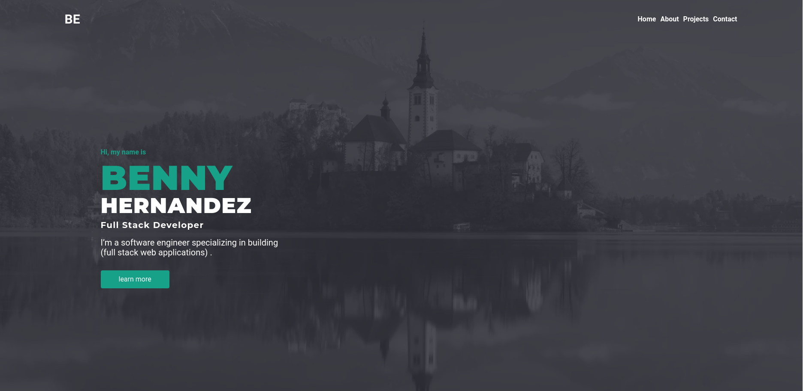

# Portfolio - V1



#### Top Technologies

[](#) [](#) [](#)

My portfolio was built to showcase projects and information that you
might want to know about me. It includes a download link to my
resume, featured projects, as well as a contact link connected to my
email. This website was built with React, TypeScript, Next.js, Emotion JS
for handling the CSS, and serverless functions to handle form validation.

## Installation

1. Download repository
   ```bash
   git clone git@github.com:Nomad-Freedom/portfolio-v1.git
   ```
2. Install packages
   ```bash
   npm install
   ```

## Run in Development

<!-- 1. add env.local file in root directory
   ```env
   NEXT_PUBLIC_API_URL=<<server-url>>
   ``` -->

1. run application
   ```bash
   npm run dev
   ```

<!-- TODO: Add last video link -->

#### :mailbox: Reach out to me!

- :paperclip: [My Resume/CV]()
- :email: inquiry@bennyhernandez.com
- :link: [bennyhernandez.com](https://www.bennyhernandez.com)
